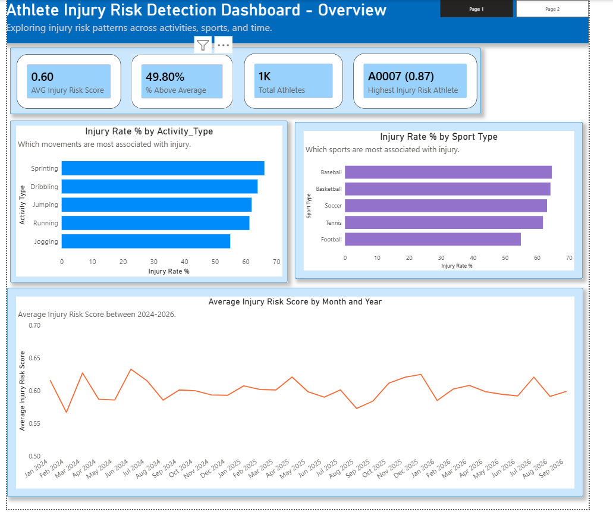
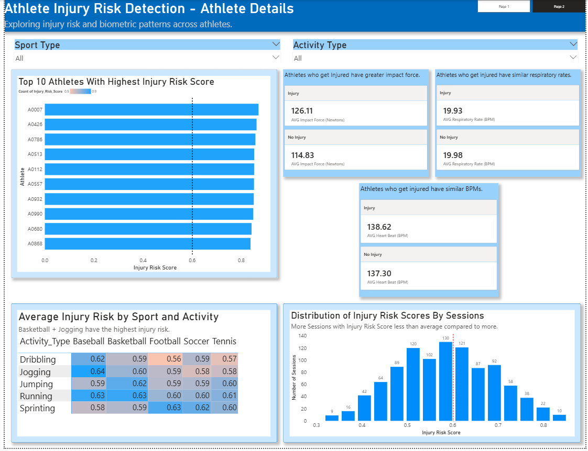

# Athlete Injury Risk Detection Dashboard

  
  

A two-page Power BI dashboard analyzing injury risk across athletes, activities, and sports.

## What it answers
- What does overall injury risk look like by activity, sport, and time?
- Which athletes are highest-risk, and why (physiological indicators)?
- Which activity/sport combinations are riskiest?

## Data Model
`fact_sessions` (session-level facts: Injury_Risk_Score, Injury Status, Impact Force, Heart Beat, Respiratory Rate) joined to `dim_athlete`, `dim_activity`, `dim_sport_type`, and `dim_date`.

## Pages
- **Overview** — KPI cards (avg risk score, % above average, total athletes, highest-risk athlete), injury rate by activity/sport, monthly risk trend.
- **Athlete Details** — Top 10 highest-risk athletes (with reference line), physiological indicators by injury status, Activity × Sport risk heatmap, risk score distribution. Filterable by sport/activity slicers.

## Key DAX Measures
- `Overall AVG Injury Risk Score` — dataset-wide average (ignores filters), used as the baseline across visuals
- `% Above Average` — share of athletes above the overall average
- `Highest Injury Risk Athlete` — Athlete_ID with the max score

## Design
A consistent green→red color scale marks risk severity across the Top 10 chart, the heatmap, and reference lines.

## Tools
Power BI Desktop
Microsoft SQL
DBeaver
